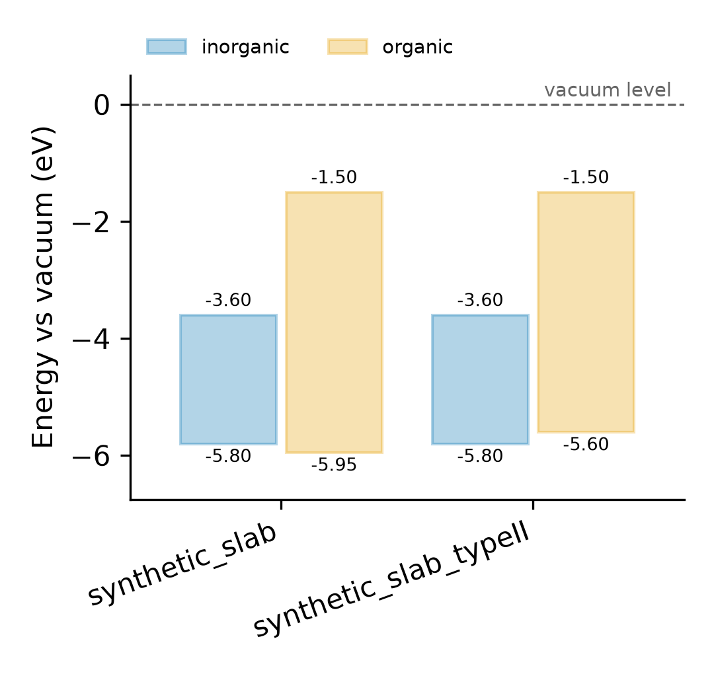
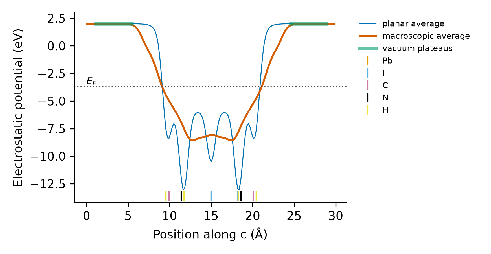

<h1 align="center">VASP Tools <sub><code>v1.0</code></sub></h1>
<p align="center">
  <b>Post-processing and sanity checks for VASP, written as tutorials.</b><br>
  Absolute band alignment · potential profiles · run diagnostics · constraints · hybrid slabs · SCF rescue<br>
  Every tool is one self-contained Python file: copy it to the cluster and run it.
</p>

<p align="center">
  <a href="https://github.com/israel-c-ribeiro/VASP_tools/actions/workflows/tests.yml"></a>
  
  
  
  
  
</p>

---

## Why

A DFT calculation is only as good as the checks around it. These scripts grew out of daily work on
surfaces and layered hybrid perovskites, and each one answers a question that, left unasked, has cost
real CPU-hours: *did the run converge, or did it only finish? Were some atoms still fixed by flags
copied from an old CONTCAR? Did my slab cut a molecule in half? Why does my hybrid-functional SCF
oscillate? Where is the VBM on an absolute scale?*

Each folder is a small **tutorial**: the physics in a few lines, the INCAR settings, a worked example
on synthetic data with a known answer, the pitfalls, and references.

## Tools

| Tool | Question it answers | Needs |
|---|---|---|
| [**Run_Diagnostics**](Run_Diagnostics) | Did my run really work? SCF of every ionic step, forces on free atoms, constraints, cell change, known VASP/Slurm errors with fixes | numpy |
| [**Selective_Dynamics**](Selective_Dynamics) | Which atoms are fixed, and what forces remain on them? Release or set constraints by height, element or index | numpy |
| [**Slab_Whole_Molecules**](Slab_Whole_Molecules) | How do I cut a slab from a layered hybrid crystal without splitting the molecules? | numpy, scipy, ase |
| [**SCF_Rescue_Hybrid**](SCF_Rescue_Hybrid) | Why does my HSE06/PBE0 SCF oscillate, and how do I make it converge? | numpy (matplotlib for plots) |
| [**LOCPOT_Planar_Average**](LOCPOT_Planar_Average) | Planar/macroscopic potential, vacuum level, work function, dipole check | numpy, matplotlib |
| [**Band_Alignment_Vacuum**](Band_Alignment_Vacuum) | VBM/CBM on the vacuum scale (IP, EA), fragment-resolved edges and type I/II/III alignment, for one run or a campaign | numpy (matplotlib for plots) |
| [MAGMOM_Vasp](MAGMOM_Vasp) | Final magnetic moments of an OUTCAR as a `MAGMOM` line for the next run | — |
| [Vacuum_Slab_Control](Vacuum_Slab_Control) | Centre a slab and add vacuum with ASE (inorganic slabs) | ase |

<p align="center">
</p>

## Suggested learning path

1. **[Run_Diagnostics](Run_Diagnostics)** — trust nothing before this says OK.
2. **[Selective_Dynamics](Selective_Dynamics)** — know what was allowed to move.
3. **[Slab_Whole_Molecules](Slab_Whole_Molecules)** — build a correct slab.
4. **[SCF_Rescue_Hybrid](SCF_Rescue_Hybrid)** — converge it with a hybrid functional.
5. **[LOCPOT_Planar_Average](LOCPOT_Planar_Average)** — check the vacuum and read the vacuum level.
6. **[Band_Alignment_Vacuum](Band_Alignment_Vacuum)** — put every band edge on an absolute scale.

## Installation

```bash
git clone https://github.com/israel-c-ribeiro/VASP_tools.git
cd VASP_tools
pip install -r requirements.txt        # numpy, matplotlib, scipy, ase
```

There is nothing to build or install: every script runs on its own, so you can also copy a single
file to a cluster login node, where numpy alone is enough for most tools.

## Quick start — five minutes, no VASP needed

The [`examples/`](examples) folder holds synthetic, format-faithful VASP outputs with a known answer
(see [`examples/README.md`](examples/README.md)).

```bash
python Run_Diagnostics/vasp_diagnose.py "examples/*" --summary
python Band_Alignment_Vacuum/band_alignment.py "examples/synthetic_slab*" \
       --fragment Pb,I --labels inorganic,organic --plot levels.png
python LOCPOT_Planar_Average/planar_average.py examples/synthetic_slab/LOCPOT --plot potential.png
python SCF_Rescue_Hybrid/scf_rescue.py diagnose examples/hybrid_scf_oscillating/OSZICAR --ediff 1e-6
```

On Linux/macOS shells quote the glob patterns as above; on Windows the scripts expand them themselves.

## Design principles

- **One file per tool.** Only the Python standard library and numpy (ASE/scipy where geometry needs
  them); no package to install on a cluster.
- **Fail loudly.** A run that did not finish, whose last SCF did not converge, or that has no vacuum
  is rejected with the reason, not silently turned into a number.
- **Known answers.** Every tutorial runs on synthetic outputs generated by
  [`examples/synthetic_vasp.py`](examples/synthetic_vasp.py), and the tests check that the tools
  recover the values put in.
- **Real formats.** VASP 5.4 and 6.x outputs; collinear, spin-polarized and non-collinear (SOC) runs;
  the four-block LOCPOT of non-collinear calculations.
- **Tested** on Linux and Windows, Python 3.10–3.12, in continuous integration.

## Repository layout

```text
VASP_tools/
├── Band_Alignment_Vacuum/     band_alignment.py   + README (tutorial)
├── LOCPOT_Planar_Average/     planar_average.py   + README
├── Run_Diagnostics/           vasp_diagnose.py    + README
├── Selective_Dynamics/        sd_tool.py          + README
├── Slab_Whole_Molecules/      make_slab.py        + README
├── SCF_Rescue_Hybrid/         scf_rescue.py       + README
├── MAGMOM_Vasp/               magmom_input.py     + README
├── Vacuum_Slab_Control/       center_vacum.py     + README
├── examples/                  synthetic VASP runs with known answers + their generator
├── docs/                      make_figures.py and the figures used in the READMEs
├── tests/                     pytest suite (runs on the synthetic examples)
└── .github/workflows/         continuous integration
```

## Testing

```bash
pip install -r requirements-dev.txt
pytest -q                       # the whole suite runs in a few seconds
python docs/make_figures.py     # regenerates every README figure through the command-line tools
```

## Related repositories

- [hpc_slurm_toolkit](https://github.com/israel-c-ribeiro/hpc_slurm_toolkit) — Slurm job templates,
  batch set-up of run folders, campaign status and data transfer.
- [materials_data_toolkit](https://github.com/israel-c-ribeiro/materials_data_toolkit) — honest
  statistics and journal-ready figures for the numbers these tools produce.
- [mace_gui_cmn](https://github.com/israel-c-ribeiro/mace_gui_cmn) — a GUI for MACE machine-learning
  potentials.

## Contributing

Contributions are welcome. If you have a script that could benefit the VASP community, open an issue
or a pull request:

1. Fork this repository and create a branch: `git checkout -b feature-name`.
2. Add your tool in its own folder with a README in the style of the others, an example and a test.
3. Run `pytest -q`, commit (`git commit -m "Add feature description"`) and push.
4. Open a pull request.

## How to cite

If these tools help your research, please cite the repository (see [`CITATION.cff`](CITATION.cff);
GitHub's *Cite this repository* button gives BibTeX and APA).

## License

MIT — see [`LICENSE`](LICENSE). VASP is a product of VASP Software GmbH; this project is not affiliated
with it, and no VASP source code or POTCAR file is distributed here.

## Acknowledgments

Special thanks to the VASP and DFT user community for providing valuable insights and fostering
collaboration, and to João H. Mazo, whose bash script inspired `MAGMOM_Vasp`.

## Author

**Israel C. Ribeiro** — Postdoctoral researcher, University of Mons (UMONS), Belgium ·
[portfolio](https://israel-c-ribeiro.github.io/) · issues and suggestions are welcome.
