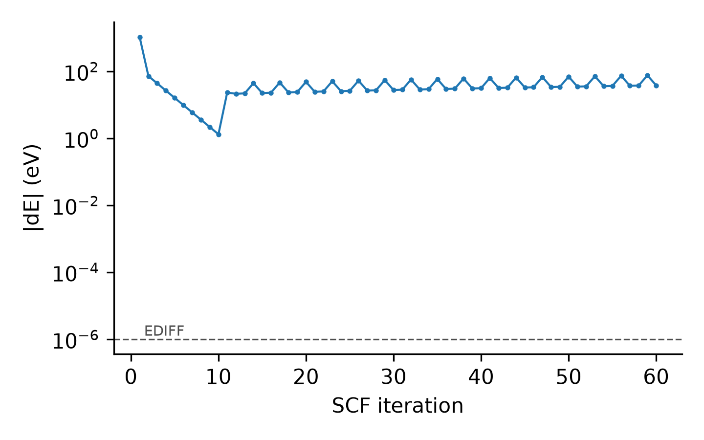

# Rescuing hybrid-functional SCF runs that will not converge

**Diagnose an SCF loop from OSZICAR (converging, slow, oscillating, diverging), and turn a failing
HSE06/PBE0 input into a robust two-step job: semilocal pre-convergence, then the production hybrid
run with damped orbital dynamics.**

<p align="center"></p>

## Recognising the problem

Plot `|dE|` (the change of the total energy between SCF iterations) on a log scale against the
iteration number. A healthy SCF is a straight line down to `EDIFF`. The figure above (synthetic data)
shows the classic failure of a hybrid run on a slab with vacuum: a clean descent for ten iterations,
then a jump and a **period-3 oscillation** that never decays, until `NELM` is reached or the
orthonormalisation fails (`ZPOTRF`).

```bash
python SCF_Rescue_Hybrid/scf_rescue.py diagnose examples/hybrid_scf_oscillating/OSZICAR \
       --ediff 1e-6 --nelm 60 --plot scf.png
```

```text
ionic iters  algo  final |dE|  verdict
    1    60   DAV   3.776E+01  OSCILLATING (charge sloshing: dE keeps changing sign without decreasing)
```

| Verdict | Shape of log10\|dE\| | Usual remedy |
|---|---|---|
| converged | straight descent below EDIFF | — |
| SLOW | still descending when NELM is reached | raise NELM; better starting point |
| OSCILLATING | sign of dE alternates, no decay | Kerker preconditioning; damped algorithm (this recipe) |
| DIVERGING | \|dE\| grows by orders of magnitude | smaller mixing; restart from good orbitals (this recipe) |
| STALLED | flat, neither oscillating nor decreasing | check geometry, NBANDS, smearing |

## Why it happens

- **Charge sloshing.** In a long cell — a slab with vacuum is the textbook case — small changes of the
  density at long wavelength produce large changes of the potential, and density mixing overshoots back
  and forth. The **Kerker preconditioner** damps exactly those long-wavelength components. In VASP its
  strength is set by `BMIX`; a tiny value (e.g. `BMIX = 0.0001`, used to obtain plain linear mixing)
  switches it off.
- **Hybrid functionals are fragile and expensive.** Each iteration includes the exact-exchange
  operator, and starting it from random orbitals often takes the SCF far from the ground state before it
  can settle.

## The two-step recipe

| | Step 1 — semilocal pre-convergence | Step 2 — production hybrid |
|---|---|---|
| functional | `LHFCALC = .FALSE.` (PBE, + SOC if the run has it) | the production INCAR, unchanged |
| start | `ISTART = 0`, `ICHARG = 2`, `NELMDL = -12` | `ISTART = 1` (step-1 WAVECAR), `ICHARG = 0`, `NELMDL = 0` |
| algorithm | `ALGO = Normal`, `AMIX = 0.2`, `BMIX = 1.0` (Kerker on) | `ALGO = Damped`, `TIME = 0.4` |
| bands | `NBANDS` fixed | the same `NBANDS` |
| outputs | `LWAVE = .TRUE.` only | everything the production run writes |

Step 2 changes only the **path** of the SCF: `ALGO = Damped` optimises all orbitals together with a
damped equation of motion, without density mixing, so the sloshing mode has nothing to feed on. The
state it converges to is the ground state of the production INCAR, so its eigenvalues, energies and
LOCPOT are those of the production settings. `ENCUT`, k-points, POSCAR and POTCAR are identical in both
steps, which is required for the WAVECAR of step 1 to be read in step 2.

```bash
python SCF_Rescue_Hybrid/scf_rescue.py prepare examples/hybrid_scf_oscillating/INCAR \
       --outcar examples/hybrid_scf_oscillating/OUTCAR --exe vasp_ncl -o rescue/
```

This writes `rescue/INCAR.step1`, `rescue/INCAR.step2` and `rescue/job_two_step.sh`. Copy the POSCAR,
KPOINTS and POTCAR of the failed run next to them and submit `job_two_step.sh`. The job runs step 1,
checks that its last SCF loop converged, keeps its OUTCAR/OSZICAR in `step1/`, then runs step 2.

| Option | Meaning |
|---|---|
| `--outcar OUTCAR` | take `NBANDS` from the failed run (recommended) |
| `--nbands N` | set `NBANDS` explicitly |
| `--exe` | `vasp_std`, `vasp_gam` or `vasp_ncl` (SOC) |
| `--job-template job.sh` | reuse the `#SBATCH` header and module lines of your own job script |

## If step 2 still struggles

1. `TIME = 0.2` (a smaller damping time step).
2. `ALGO = All` (conjugate-gradient optimisation of all bands).
3. Check the geometry: atoms that are too close, or a molecule split across the vacuum
   (see [`Slab_Whole_Molecules`](../Slab_Whole_Molecules)), make every algorithm fail.

## References

- G. P. Kerker, *Phys. Rev. B* **23**, 3082 (1981) — the Kerker preconditioner.
- VASP wiki: [ALGO](https://www.vasp.at/wiki/index.php/ALGO), [BMIX](https://www.vasp.at/wiki/index.php/BMIX),
  [TIME](https://www.vasp.at/wiki/index.php/TIME), [LHFCALC](https://www.vasp.at/wiki/index.php/LHFCALC).
