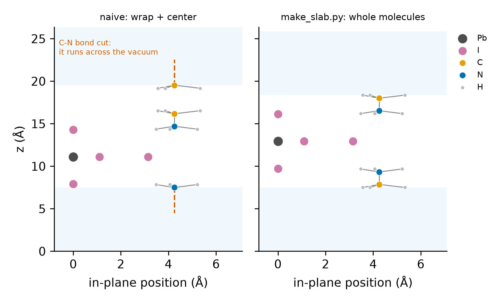

# Slabs of layered hybrid materials with whole molecules

**Cut a slab with vacuum from a layered organic–inorganic bulk cell (2D perovskites and similar)
without breaking the molecules that cross the cell boundary.**

## The problem

The standard recipe for a slab — wrap the atoms into the cell, then `atoms.center(vacuum, axis=2)` in
ASE — treats every atom independently. In a layered hybrid crystal the organic molecules very often
cross the cell boundary along the stacking axis. Wrapped atom by atom, such a molecule is cut in two:
one half ends up at the top of the slab, the other half at the bottom, and the bond between them now
runs across the vacuum.

<p align="center"></p>

Nothing crashes: VASP happily computes a slab full of radicals. The symptom is in the geometry (a C–N
or C–H "bond" of 15 Å across the vacuum) and later in the electronic structure (gap states, wrong band
edges, a huge dipole).

## How the script avoids it

1. The inorganic layer is located from the `--center` element (e.g. Pb); every inorganic atom is
   moved to the periodic image closest to that plane.
2. The molecules are found as connected components of the remaining atoms (covalent radii × 1.2,
   periodic bonds), and each one is **rebuilt through its bonds** (minimum image).
3. Each molecule is moved, as a whole, to the image where its anchor atom (`--anchor`, e.g. the
   ammonium N) is closest to the layer.
4. `--vacuum` Å are opened along the stacking axis (half on each side), and species are sorted with
   `--order` so the POTCAR can be concatenated in the same order.
5. The result is **checked**: number of connected pieces (molecules + 1 layer) before and after, and
   every X–H bond length.

Atoms only move by lattice vectors, so bonds, angles and the crystal itself are unchanged.

## Quick start with the example data

[`examples/layered_bulk/POSCAR`](../examples/layered_bulk) is a synthetic layered cell in which one
cation crosses the c boundary.

```bash
python Slab_Whole_Molecules/make_slab.py examples/layered_bulk/POSCAR -o POSCAR_naive --naive
```

```text
bulk : 21 atoms, 2 molecules, c = 13.500 Å
slab : c = 27.030 Å, atom-free gap 15.00 Å -> POSCAR_naive
connected pieces in the slab: 4 (expected 3: 2 molecules + 1 layer)
X-H bonds: 12, 1.018-1.091 Å
check: FAILED - 1 extra piece(s): molecules are split across the vacuum
```

The X–H bonds look fine here because the cut bond is the C–N bond; counting connected pieces catches
it anyway.

```bash
python Slab_Whole_Molecules/make_slab.py examples/layered_bulk/POSCAR -o POSCAR_slab \
       --inorganic Pb,I --center Pb --anchor N --vacuum 15 --order C,H,I,N,Pb
```

```text
bulk : 21 atoms, 2 molecules, c = 13.500 Å
slab : c = 25.860 Å, atom-free gap 15.00 Å -> POSCAR_slab
connected pieces in the slab: 3 (expected 3: 2 molecules + 1 layer)
X-H bonds: 12, 1.018-1.091 Å
check: OK, every molecule is whole
```

## Options

| Option | Default | Meaning |
|---|---|---|
| `--inorganic` | `Pb,I` | elements of the inorganic framework (e.g. `Sn,Br`, `Bi,I`) |
| `--center` | `Pb` | element whose mean plane defines the layer |
| `--anchor` | `N` | atom of each molecule kept next to the layer (molecules without it use their centroid) |
| `--vacuum` | `15` | total vacuum thickness (Å) |
| `--axis` | `2` | stacking axis (0 = a, 1 = b, 2 = c) |
| `--order` | first appearance | species order of the output, to match the POTCAR |
| `--naive` | — | atom-by-atom recipe, to see the problem |

Exit code 0 if the check passes, 1 otherwise.

## Limits

- The bulk cell must contain **one** inorganic layer per repeat along the stacking axis (any thickness
  n = 1, 2, 3 … of that layer). Cells with two staggered layers per repeat are refused; reduce or cut
  the cell first.
- The slab keeps the in-plane cell of the bulk. Relax the slab (or at least its organic part) before
  computing surface properties if the bulk was not relaxed with the same settings.
- Requires `numpy`, `scipy` and `ase`.

## Related tools

- [`Vacuum_Slab_Control`](../Vacuum_Slab_Control) — the minimal ASE recipe, fine for purely inorganic slabs.
- [`Band_Alignment_Vacuum`](../Band_Alignment_Vacuum) — band edges of the slab on the vacuum scale.
